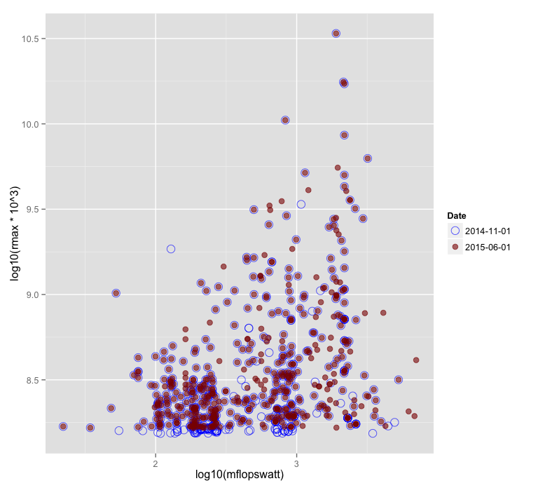
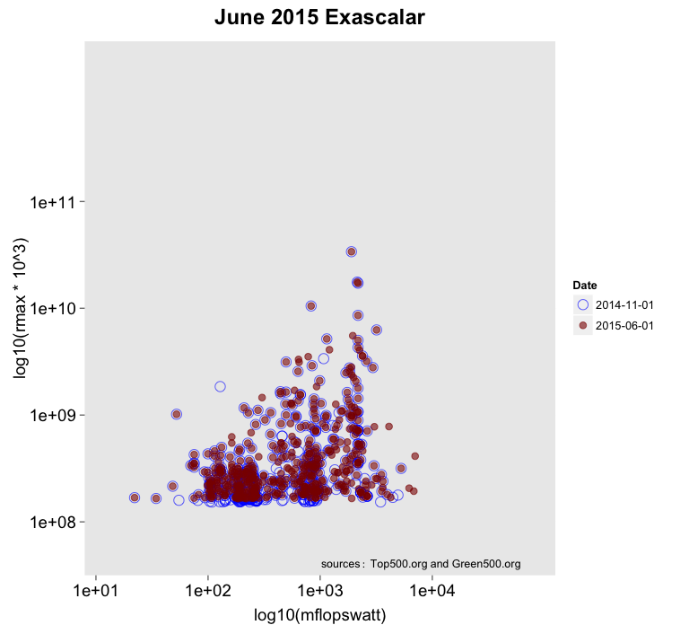
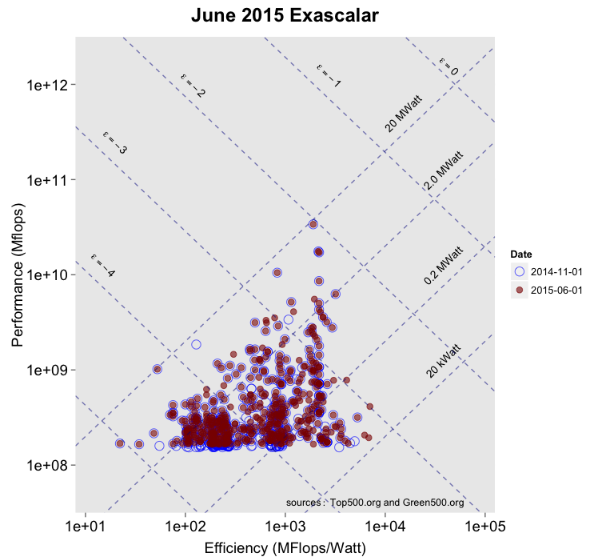

# June 2015 Top500, Green500, and Exascalar
Winston Saunders  
August 02, 2015  

###June 2015 Green500 and Top500

[Exascalar](http://www.datacenterknowledge.com/archives/2012/07/10/june-2012-exascalar-efficiency-dominates-hpc/) analysis is an informative way to visualize the supercomputer landscape of both efficiency and performance (as measured by the [Green500](http:\\green500.org) and [Top500](http:\\top500.org) lists, respectively). 

As with the past few lists, the analysis is especially revealing: while the #1 supercomputer in the Top500 has not changed in the last _five_ publications of the lists, the population of the Green500 list has been far from stagnant. Since historically efficiency leadership has prediated performance leadership, the analysis allows us to "look ahead" to understand high perfomrance systems of the future. 


### Exascalar Plot 

The easiest way to visualize change in the Top500 and Green500 lists is to overlay the Exascalar plots of November 2014 with that of June 2015.  

In the plot below points from June 2015 are smaller red dots, points with empty blue circles are computers that are no longer on the list, and red points with blue circles around them are computers on both lists. Changes are clearly visible. While the highestperformance computer did not change, changes within the population as well as at the extremes of efficiency are evident.   



```
## [1] 13.87054
```




####KPI's: Bounding the November 2014 Supercomputer Population

Since Exascalar, as visulaized by above, is mostly descriptive of the _population_ of supercomputers, it's interesting to understand the parameters of the population as these comprise some of the more interesting computers from the list. These Key Performance Indicators of the population are listed below.  

It is worthwhile to note that the highest Exascalar, lowest Exascalar, and Lowest Power system describe, roughly, the "vertices"" of the triangular shape of the population, while the highest power, lowest performance and highest efficiency roughly bound the "sides"" of the triangle.  
 


```
## Warning in max(Temp_New$power): no non-missing arguments to max; returning
## -Inf
```

```
## Warning in min(Temp_New$power): no non-missing arguments to min; returning
## Inf
```

<!-- html table generated in R 3.2.2 by xtable 1.7-4 package -->
<!-- Wed Sep 16 17:45:50 2015 -->
<table border=1>
<tr> <th>  </th> <th> ExaRank </th> <th> exascalar </th> <th> top500rank </th> <th> green500rank.g </th> <th> rmax.g </th> <th> power.g </th> <th> mflopswatt.g </th>  </tr>
  <tr> <td align="right"> Top Performance </td> <td align="right">   1 </td> <td align="right"> -2.04 </td> <td align="right">   1 </td> <td align="right">  83 </td> <td align="right"> 33862700.00 </td> <td align="right"> 17808.00 </td> <td align="right"> 1901.54 </td> </tr>
  <tr> <td align="right"> Top Efficiency </td> <td align="right">  27 </td> <td align="right"> -3.00 </td> <td align="right"> 160 </td> <td align="right">   1 </td> <td align="right"> 353820.00 </td> <td align="right"> 50.32 </td> <td align="right"> 7031.58 </td> </tr>
  <tr> <td align="right"> Lowest Performance </td> <td align="right"> 457 </td> <td align="right"> -4.39 </td> <td align="right"> 500 </td> <td align="right"> 408 </td> <td align="right"> 164790.72 </td> <td align="right"> 887.10 </td> <td align="right"> 185.76 </td> </tr>
  <tr> <td align="right"> Lowest Efficiency </td> <td align="right"> 500 </td> <td align="right"> -5.04 </td> <td align="right"> 475 </td> <td align="right"> 500 </td> <td align="right"> 168600.00 </td> <td align="right"> 7625.82 </td> <td align="right"> 22.11 </td> </tr>
  <tr> <td align="right"> Highest Exascalar </td> <td align="right">   1 </td> <td align="right"> -2.04 </td> <td align="right">   1 </td> <td align="right">  83 </td> <td align="right"> 33862700.00 </td> <td align="right"> 17808.00 </td> <td align="right"> 1901.54 </td> </tr>
  <tr> <td align="right"> Lowest Exascalar </td> <td align="right"> 500 </td> <td align="right"> -5.04 </td> <td align="right"> 475 </td> <td align="right"> 500 </td> <td align="right"> 168600.00 </td> <td align="right"> 7625.82 </td> <td align="right"> 22.11 </td> </tr>
   </table>


####KPI's for the Population of New Entrants

Of the _new_ entrants its interesting to note the same parameters as above as a kind of bound on the population of the newest systems. It's interesting to note in this particular year new systems occupy both the highest and lowest efficiency. 


The median Exascalar of the New Computers is -3.52 compared to the median of all computers on the June 2015 list -3.84 and the November 2014 list -3.99.


<style>

table { 
    display: table;
    border-collapse: collapse;
    border-spacing: 10px;
    border-color: gray;
    background-color: #a1b2c3;
    text-align: center
    font: 12px arial, sans-serif;
}
th, td {
    
    padding: 5px;
}
</style>


```
## Warning in max(NewList$power): no non-missing arguments to max; returning -
## Inf
```

```
## Warning in min(NewList$power): no non-missing arguments to min; returning
## Inf
```

<!-- html table generated in R 3.2.2 by xtable 1.7-4 package -->
<!-- Wed Sep 16 17:45:50 2015 -->
<table border=1>
<tr> <th>  </th> <th> ExaRank </th> <th> exascalar </th> <th> top500rank </th> <th> green500rank.g </th> <th> rmax.g </th> <th> power.g </th> <th> mflopswatt.g </th>  </tr>
  <tr> <td align="right"> Top Performance </td> <td align="right">   7 </td> <td align="right"> -2.59 </td> <td align="right">   7 </td> <td align="right">  75 </td> <td align="right"> 5536990.00 </td> <td align="right"> 2834.00 </td> <td align="right"> 1953.77 </td> </tr>
  <tr> <td align="right"> Top Efficiency </td> <td align="right">  27 </td> <td align="right"> -3.00 </td> <td align="right"> 160 </td> <td align="right">   1 </td> <td align="right"> 353820.00 </td> <td align="right"> 50.32 </td> <td align="right"> 7031.58 </td> </tr>
  <tr> <td align="right"> Lowest Performance </td> <td align="right"> 194 </td> <td align="right"> -3.67 </td> <td align="right"> 497 </td> <td align="right">  78 </td> <td align="right"> 165887.00 </td> <td align="right"> 86.77 </td> <td align="right"> 1911.80 </td> </tr>
  <tr> <td align="right"> Lowest Efficiency </td> <td align="right"> 485 </td> <td align="right"> -4.50 </td> <td align="right"> 337 </td> <td align="right"> 487 </td> <td align="right"> 218407.00 </td> <td align="right"> 2217.60 </td> <td align="right"> 98.49 </td> </tr>
  <tr> <td align="right"> Highest Exascalar </td> <td align="right">   7 </td> <td align="right"> -2.59 </td> <td align="right">   7 </td> <td align="right">  75 </td> <td align="right"> 5536990.00 </td> <td align="right"> 2834.00 </td> <td align="right"> 1953.77 </td> </tr>
  <tr> <td align="right"> Lowest Exascalar </td> <td align="right"> 485 </td> <td align="right"> -4.50 </td> <td align="right"> 337 </td> <td align="right"> 487 </td> <td align="right"> 218407.00 </td> <td align="right"> 2217.60 </td> <td align="right"> 98.49 </td> </tr>
   </table>


