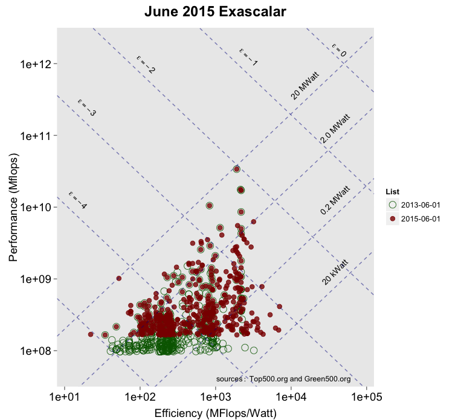
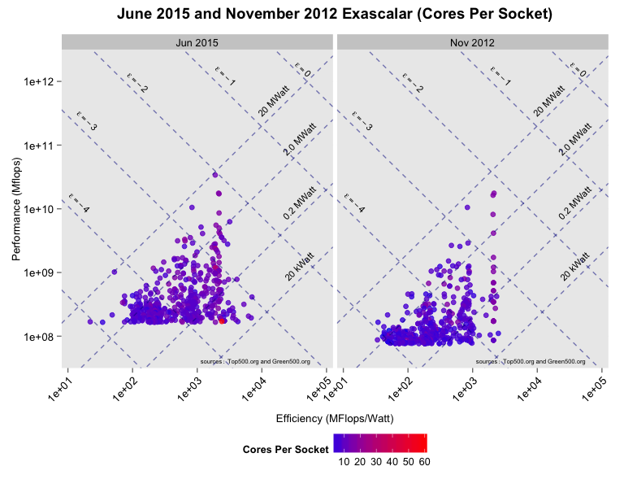
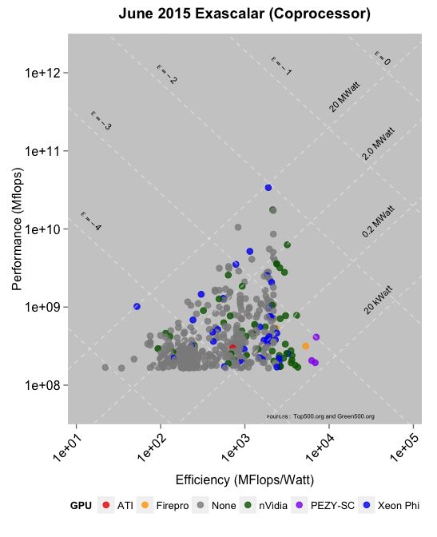
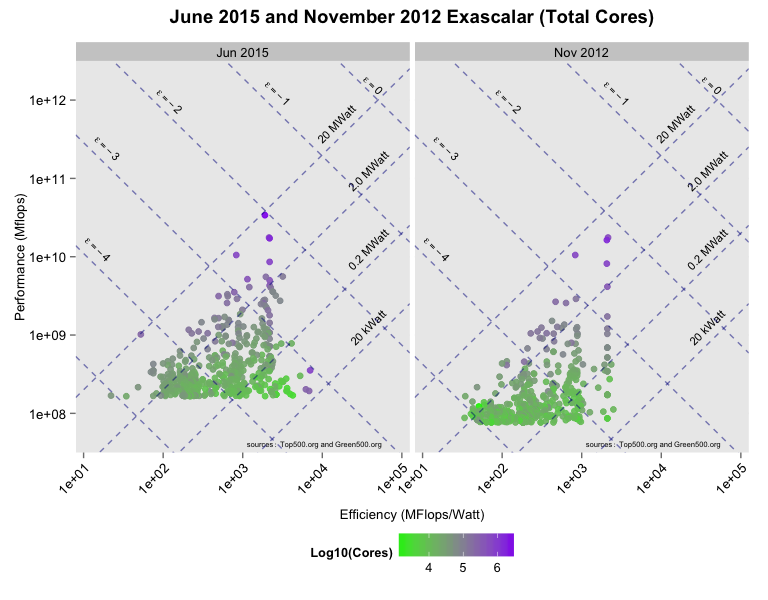

# June 2015 Top500, Green500, and Exascalar
Winston Saunders  
Sept 16, 2015  
---


#Summary

While the #1 performing supercomputer in the Top500 has not changed in the last _five_ publications of the Top500 list (since Jun 2013), the population of the Top500 and Green500 list has been far from stagnant.  

Exascalar explores the full richness of this data thru simple "data visuaization" which in this case is a fancy name for plotting. 
 
Several new analyses, suggested by others thru email and twitter, have been added. Notably, graphs looking at core counts and GPU architecture reveal insights into differentiation among different super computers. 


##Reach me
While source code is made freely available on Github, I welcome suggestions for additional anlayses (or even half-baked experiments) which might be of interest. You can reach me via twitter [\@WinstonOnEnergy](https://twitter.com/WinstonOnEnergy)

##Disclaimer
This analysis is done independently and reflects my opinions alone. In particular, it in no way reflects opinions of my employer (Intel Corporation) or any other entity with which I'm affiliated.

##Background

Supercomputer leadership requires both extreme scale and high efficiency. The [Green500](http:\\green500.org) and [Top500](http:\\top500.org) lists are excellent resources for understanding this. But they are both, well, lists, which makes it hard to recognize trends and correlations. 
The approach here is to leverage data visualization techniques to explore some of the richness of the combined high quality data contained in both lists. While the Top500 emphasizes highest performance, and the Gree500 emphasizes the highest efficiency, [Exascalar](http://www.datacenterknowledge.com/archives/2012/07/10/june-2012-exascalar-efficiency-dominates-hpc/) analysis is conceived as a way to visualize supercomputer efficiency and performance in one coherent picture. 

The name Exascalar originates from the goal of achieving an exaflops, $10^{12}$ mflops, in an envelope of $20$ MWatt. Exascalar is a logarithmic parametric indicator of progress in efficiency and performance along an iso-power line toward this goal. You can actually [Google it](http://www.google.com/webhp?hl=en#safe=off&hl=en&q=Exascalar). 


#June 2015 Exascalar 


##June 2015 Exascalar Plot

The easiest way to visualize change in the Top500 and Green500 lists is to overlay the Exascalar plots of November 2014 with that of June 2015.  

In the plot below points from June 2015 are smaller red dots, points with empty blue circles are computers that are no longer on the list, and red points with blue circles around them are computers on both lists. Changes are clearly visible. While the highestperformance computer did not change, changes within the population as well as at the extremes of efficiency are evident.   


###Reaching back: Comparing to June 2013

To emphasize the massive changes in the population of the top supercomputers, it's instructive to compare not only to the last iteration, but also the last iteration where the #1 Supercomputer changed, two years ago in June 2013. In intervening years the minimum perforamnce needed to make the Top500 has increased over 50%. In addition, the maximum efficiency has increased by about the same magnitude. This neatly emphasizes why the _population_ holds as much (and perhaps more) interest as the top one or two systems. 


```
## Warning: Removed 2 rows containing missing values (geom_point).
```



##Key Indicators June 2015 Lists

Exascalar, as visulaized by above, is descriptive of the _population_ of supercomputers. Here ia a list of some of the key systems. Note that Exascalar spans from the highest performance to the lowest efficiency system.


<!-- html table generated in R 3.2.2 by xtable 1.7-4 package -->
<!-- Wed Sep 23 05:09:57 2015 -->
<table border=1>
<tr> <th>  </th> <th> Exa Rank </th> <th> Exascalar </th> <th> Performance Rank </th> <th> Efficiency Rank </th> <th> rmax (mflops) </th> <th> power (kW) </th> <th> efficiency (mflops/Watt) </th>  </tr>
  <tr> <td align="right"> Top Exascalar </td> <td align="right">   1 </td> <td align="right"> -2.04 </td> <td align="right">   1 </td> <td align="right">  83 </td> <td align="right"> 33862700.00 </td> <td align="right"> 17808.00 </td> <td align="right"> 1901.54 </td> </tr>
  <tr> <td align="right"> Bottom Exascalar </td> <td align="right"> 500 </td> <td align="right"> -5.04 </td> <td align="right"> 475 </td> <td align="right"> 500 </td> <td align="right"> 168600.00 </td> <td align="right"> 7625.82 </td> <td align="right"> 22.11 </td> </tr>
  <tr> <td align="right"> Top Performance </td> <td align="right">   1 </td> <td align="right"> -2.04 </td> <td align="right">   1 </td> <td align="right">  83 </td> <td align="right"> 33862700.00 </td> <td align="right"> 17808.00 </td> <td align="right"> 1901.54 </td> </tr>
  <tr> <td align="right"> Top Efficiency </td> <td align="right">  27 </td> <td align="right"> -3.00 </td> <td align="right"> 160 </td> <td align="right">   1 </td> <td align="right"> 353820.00 </td> <td align="right"> 50.32 </td> <td align="right"> 7031.58 </td> </tr>
  <tr> <td align="right"> Low Efficiency </td> <td align="right"> 500 </td> <td align="right"> -5.04 </td> <td align="right"> 475 </td> <td align="right"> 500 </td> <td align="right"> 168600.00 </td> <td align="right"> 7625.82 </td> <td align="right"> 22.11 </td> </tr>
   </table>


##Key New Entrants June 2015 

Of the _new_ entrants its interesting to note the same parameters as above as a kind of bound on the population of the newest systems. It's interesting to note in this particular year new systems occupy both the highest and lowest efficiency. 


The median Exascalar of the New Computers is -3.52 compared to the median of all computers on the June 2015 list -3.84 and the November 2014 list -3.99.


<style>

table { 
    display: table;
    border-collapse: collapse;
    border-spacing: 10px;
    border-color: gray;
    background-color: #a1b2c3;
    text-align: center
    font: 12px arial, sans-serif;
}
th, td {
    
    padding: 5px;
}
</style>


<!-- html table generated in R 3.2.2 by xtable 1.7-4 package -->
<!-- Wed Sep 23 05:09:57 2015 -->
<table border=1>
<tr> <th>  </th> <th> Exa Rank </th> <th> Exascalar </th> <th> Performance Rank </th> <th> Efficiency Rank </th> <th> rmax (mflops) </th> <th> power (kW) </th> <th> efficiency (mflops/Watt) </th>  </tr>
  <tr> <td align="right"> Top Exascalar </td> <td align="right">   7 </td> <td align="right"> -2.59 </td> <td align="right">   7 </td> <td align="right">  75 </td> <td align="right"> 5536990.00 </td> <td align="right"> 2834.00 </td> <td align="right"> 1953.77 </td> </tr>
  <tr> <td align="right"> Top Performance </td> <td align="right">   7 </td> <td align="right"> -2.59 </td> <td align="right">   7 </td> <td align="right">  75 </td> <td align="right"> 5536990.00 </td> <td align="right"> 2834.00 </td> <td align="right"> 1953.77 </td> </tr>
  <tr> <td align="right"> Top Efficiency </td> <td align="right">  27 </td> <td align="right"> -3.00 </td> <td align="right"> 160 </td> <td align="right">   1 </td> <td align="right"> 353820.00 </td> <td align="right"> 50.32 </td> <td align="right"> 7031.58 </td> </tr>
   </table>


#Trends

Exascalar is useful for visualizing trends in the population. The graphs below illustrate how top efficiency and performance have evolved over the last several years. 

##Efficiency of Top-Efficiency and Top-Performance Systems

THe trend of the Efficiency of the #1 Top500 and the T #1 Green500 lists is interesting in that is shows "fits and starts" of the Top500 systme as it jumps to new tiers of efficiency versus the stead evolution of the Green500 systems. It's interesting to note that the gap in efficiency between the two systems appears to be at an alltime high, suggesting another jump may soon be in our future.


##Exascalar of Top-Efficiency and Top-Performance Systems

We can also look at progress of the top systems along the Exascalar parameter. Note here that jumps in the Top500 correlate to when the Green500 system is closest to the Top500 curve. It's not surprising (indeed it is expected), but the visualization helps highlight the behavior. 


##Technology Trends

In this section we visually explore different influencers of the supercomputer populations. Some of these graphs were "requests" and others are just interesting. 

###Cores Per Socket

This graph, showing the the side by side comparison of the November 2012 and current June 2015 plots shows clearly the evolution in cores per socket as a shift to redder data points in the latter graph. This encodes the __coressocket__ data from the Top500 list.  
Te side-by-side comparison here also highlights how the IBM Power systems, so dominant in both efficiency and performance, in the Novermber 2012 list, have been matched and now exceeded by alternative architectures. In particular, the role of GPU and GPU architecture will become apparent in the analysis below.  




###Processor

The processor plays a big role in the supercomputer. Here, to simplify, I have taken the __processorgeneration__ data and simplified it to capture only the manufacturer. The near ubiquity of Intel processors is evident.


###Accelerator Co-Processor

Encoding the __aceeleratorcoprocessor__ data from the Green500 list highlights interesting differentiation among different manufacturers very clearly. For the sake of clarity list elements have been reduced to just the manufacturer.



###Total Number of Cores

Another interesting trend is the total number of cores. Since this is an extrinsic parameter, we encode the logarithm. Again, the shift up in performance, and the shift toward higher overall core count is apparent. The __totalcores__ data from the Top500 list are used.




###Accelerator Processor Cores

Here we can see where Accelerator Processors (GPUs) are making their way into the Top500 population. While high core count systems play an obvious role in high perfoormance, lower core counts have an interesting play at the high efficiency end (even if they have not yet achieved scale). Here the __acceleratorcoprocessor__ data from the Top500 are encoded.


#Summary

While the #1 Supercomputer has remained unchanged for two years, the technology of supercomputing is undergoing rapid evolution. Based on historical trends, another push to higher performance seems overdue.  

Cores per socket are driving a large part of the gains, while GPU architecture and total cores play an evident role in pushing to higher efficiency and greater performance.  

##Final Query
In looking at the Top500 and Green500 data thru the lens of Exascalar, systems with exascalar $\epsilon$ < -4.0 are technologically of little interest. Indeed, as time evolves, they are really just roadkill. Would it be more interesting and meaningful to include more advanced systems, perhaps with lower overall performance, but higher efficiency, rather than low efficiency, low performing systems, in an overall list of leading supercomputers? 
