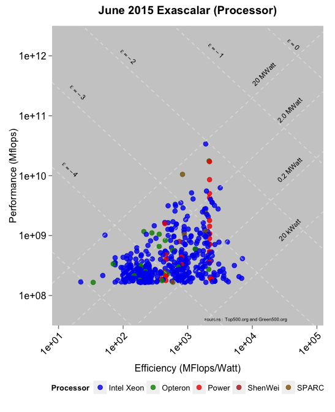
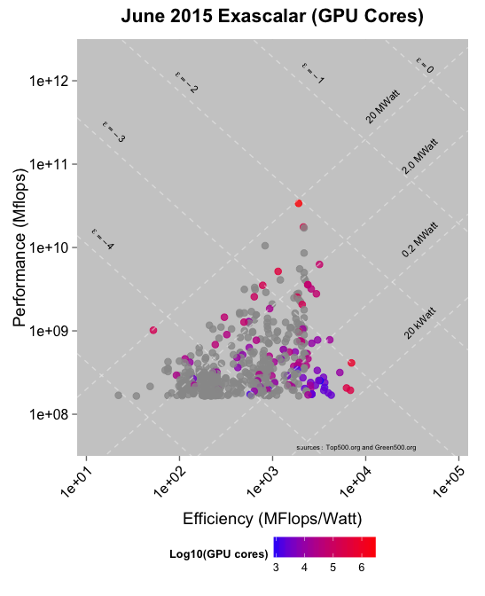

# June 2015 Top500, Green500, and Exascalar
Winston Saunders  
Sept 16, 2015  
---

#Executive Summary

While the #1 performing supercomputer in the Top500 has not changed in the last _five_ publications of the Top500 list, the population of the Top500 and Green500 list has been far from stagnant, especially as efficience has increased. 

This analysis 

In this addition several new analyses, suggested by others, have been added. Notably, graphs looking at both core counts GPU architecture reveal insights into differentiation among different super computers. 

(My apologies for the delay in publication. My work at Intel, now in the domain of Information Security, is not directly related to this subject matter. As always, any opinions expressed here are my own and not those of my employer.)

##Exascalar Background

[Exascalar](http://www.datacenterknowledge.com/archives/2012/07/10/june-2012-exascalar-efficiency-dominates-hpc/) analysis is an informative way to visualize supercomputer lefficiency and performance (as measured by the [Green500](http:\\green500.org) and [Top500](http:\\top500.org) lists, respectively) in one coherent picture.

Sit back and Enjoy the Tour.

#Exascalar 

##June 2015 Top500 and Green500

##June 2015 Exascalar 

The easiest way to visualize change in the Top500 and Green500 lists is to overlay the Exascalar plots of November 2014 with that of June 2015.  

In the plot below points from June 2015 are smaller red dots, points with empty blue circles are computers that are no longer on the list, and red points with blue circles around them are computers on both lists. Changes are clearly visible. While the highestperformance computer did not change, changes within the population as well as at the extremes of efficiency are evident.   

###Since November 2012

To emphasize the massive changes in the population of the top supercomputers, it's instructive to compare not only to the last iteration, but also the last iteration where the #1 Supercomputer changed, in November 2012. 

##Key Indicators June 2015 Lists

Exascalar, as visulaized by above, is descriptive of the _population_ of supercomputers. Here are some of the key Parameters.

<!-- html table generated in R 3.2.2 by xtable 1.7-4 package -->
<!-- Mon Sep 21 19:17:00 2015 -->
<table border=1>
<tr> <th>  </th> <th> Exa Rank </th> <th> Exascalar </th> <th> Performance Rank </th> <th> Efficiency Rank </th> <th> rmax (mflops) </th> <th> power (kW) </th> <th> efficiency (mflops/Watt) </th>  </tr>
  <tr> <td align="right"> Top Performance </td> <td align="right">   1 </td> <td align="right"> -2.04 </td> <td align="right">   1 </td> <td align="right">  83 </td> <td align="right"> 33862700.00 </td> <td align="right"> 17808.00 </td> <td align="right"> 1901.54 </td> </tr>
  <tr> <td align="right"> Top Efficiency </td> <td align="right">  27 </td> <td align="right"> -3.00 </td> <td align="right"> 160 </td> <td align="right">   1 </td> <td align="right"> 353820.00 </td> <td align="right"> 50.32 </td> <td align="right"> 7031.58 </td> </tr>
  <tr> <td align="right"> Low Efficiency </td> <td align="right"> 500 </td> <td align="right"> -5.04 </td> <td align="right"> 475 </td> <td align="right"> 500 </td> <td align="right"> 168600.00 </td> <td align="right"> 7625.82 </td> <td align="right"> 22.11 </td> </tr>
  <tr> <td align="right"> Top Exascalar </td> <td align="right">   1 </td> <td align="right"> -2.04 </td> <td align="right">   1 </td> <td align="right">  83 </td> <td align="right"> 33862700.00 </td> <td align="right"> 17808.00 </td> <td align="right"> 1901.54 </td> </tr>
  <tr> <td align="right"> Bottom Exascalar </td> <td align="right"> 500 </td> <td align="right"> -5.04 </td> <td align="right"> 475 </td> <td align="right"> 500 </td> <td align="right"> 168600.00 </td> <td align="right"> 7625.82 </td> <td align="right"> 22.11 </td> </tr>
   </table>

##Key Indicators for New Entrants June 2015 

Of the _new_ entrants its interesting to note the same parameters as above as a kind of bound on the population of the newest systems. It's interesting to note in this particular year new systems occupy both the highest and lowest efficiency. 

The median Exascalar of the New Computers is -3.52 compared to the median of all computers on the June 2015 list -3.84 and the November 2014 list -3.99.

<!-- html table generated in R 3.2.2 by xtable 1.7-4 package -->
<!-- Mon Sep 21 19:17:00 2015 -->
<table border=1>
<tr> <th>  </th> <th> Exa Rank </th> <th> Exascalar </th> <th> Performance Rank </th> <th> Efficiency Rank </th> <th> rmax (mflops) </th> <th> power (kW) </th> <th> efficiency (mflops/Watt) </th>  </tr>
  <tr> <td align="right"> Top Performance </td> <td align="right">   7 </td> <td align="right"> -2.59 </td> <td align="right">   7 </td> <td align="right">  75 </td> <td align="right"> 5536990.00 </td> <td align="right"> 2834.00 </td> <td align="right"> 1953.77 </td> </tr>
  <tr> <td align="right"> Top Efficiency </td> <td align="right">  27 </td> <td align="right"> -3.00 </td> <td align="right"> 160 </td> <td align="right">   1 </td> <td align="right"> 353820.00 </td> <td align="right"> 50.32 </td> <td align="right"> 7031.58 </td> </tr>
  <tr> <td align="right"> Top Exascalar </td> <td align="right">   7 </td> <td align="right"> -2.59 </td> <td align="right">   7 </td> <td align="right">  75 </td> <td align="right"> 5536990.00 </td> <td align="right"> 2834.00 </td> <td align="right"> 1953.77 </td> </tr>
   </table>

#Trends

##Efficiency of Top-Efficiency and Top-Performance Systems

##Exascalar of Top Efficiency and Top Performance Systems

## Supercomputing Technologies and Trends

####Number of Cores

####Total Cores

####Processor Generation

####Accelerator

