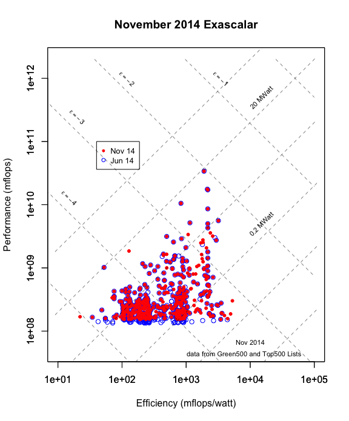

# Visualizing change: Top500, Green500, and Exascalar
Winston Saunders  
November 27, 2014  

###Comparing November and June 2014 Green500 and Top500

Exascalar is one of the best ways to visualize changes in the [Green500](http:\\green500.org) and [Top500](http:\\top500.org) lists since it compares both the performance and efficiency of systems in one common analysis. 

In this case the analysis is especially revealing: while the #1 supercomputer in the Top500 has not changed in the last four publications of the lists, the population of the Top500 list has been far from stagnant. This is best revealed by looking at a "comprehenive" set of KPI's for the population.

### Exascalar Plot 

The easiest way to visualize change in the Top500 and Green500 lists is to overlay the Exascalar plots of November 2014 with that of June 2014.  

In the plot below points from November are smaller red dots, points with empty blue circles are computers that are no longer on the list, and red points with blue circles around them are computers on both lists. Changes are clearly visible. While the highestperformance computer did not change, changes within the population as well as at the extremes o efficiency are evident.   

####KPI's: Bounding the November 2014 Supercomputer Population

Since Exascalar, as visulaized by above, is mostly descriptive of the _population_ of supercomputers, it's interesting to understand the parameters of the population as these comprise some of the more interesting computers from the list. These Key Performance Indicators of the population are listed below.  

It is worthwhile to note that the highest Exascalar, lowest Exascalar, and Lowest Power system describe, roughly, the "vertices"" of the triangular shape of the population, while the highest power, lowest performance and highest efficiency roughly bound the "sides"" of the triangle.  
 

<!-- html table generated in R 3.1.2 by xtable 1.7-4 package -->
<!-- Sat Nov 29 13:27:17 2014 -->
<table border=1>
<tr> <th>  </th> <th> ExaRank </th> <th> green500rank </th> <th> top500rank </th> <th> rmax </th> <th> power </th> <th> mflopswatt </th> <th> computer </th>  </tr>
  <tr> <td align="right"> Top Performance </td> <td align="right">   1 </td> <td align="right">  64 </td> <td align="right">   1 </td> <td align="right"> 33862700.00 </td> <td align="right"> 17808.00 </td> <td align="right"> 1901.54 </td> <td> TH-IVB-FEP Cluster, Intel Xeon E5-2692 12C 2.200GHz, TH Express-2, Intel Xeon Phi 31S1P </td> </tr>
  <tr> <td align="right"> Top Efficiency </td> <td align="right">  34 </td> <td align="right">   1 </td> <td align="right"> 168 </td> <td align="right"> 301300.00 </td> <td align="right"> 57.15 </td> <td align="right"> 5271.81 </td> <td> ASUS ESC4000 FDR/G2S, Intel Xeon E5-2690v2 10C 3GHz, Infiniband FDR, AMD FirePro S9150 </td> </tr>
  <tr> <td align="right"> Highest Power </td> <td align="right"> 315 </td> <td align="right"> 497 </td> <td align="right">  49 </td> <td align="right"> 1018000.00 </td> <td align="right"> 19431.30 </td> <td align="right"> 52.39 </td> <td> HA8000-tc HT210/PRIMERGY CX400 Cluster, Xeon E5-2680 8C 2.700GHz, Infiniband FDR, NVIDIA K20/K20x, Xeon Phi 5110P </td> </tr>
  <tr> <td align="right"> Lowest Performance </td> <td align="right"> 491 </td> <td align="right"> 468 </td> <td align="right"> 500 </td> <td align="right"> 153381.00 </td> <td align="right"> 1417.20 </td> <td align="right"> 108.23 </td> <td> Cluster Platform DL360e Gen8, Xeon E5-2450 8C 2.100GHz, Gigabit Ethernet </td> </tr>
  <tr> <td align="right"> Lowest Efficiency </td> <td align="right"> 500 </td> <td align="right"> 500 </td> <td align="right"> 398 </td> <td align="right"> 168600.00 </td> <td align="right"> 7625.82 </td> <td align="right"> 22.11 </td> <td> BladeCenter HS23 Cluster, Xeon E5-2670 8C 2.6GHz, Gigabit Ethernet </td> </tr>
  <tr> <td align="right"> Lowest Power </td> <td align="right">  83 </td> <td align="right">   3 </td> <td align="right"> 392 </td> <td align="right"> 157400.00 </td> <td align="right"> 35.39 </td> <td align="right"> 4447.58 </td> <td> LX 1U-4GPU/104Re-1G  Cluster, Intel Xeon E5-2620v2 6C 2.100GHz, Infiniband FDR, NVIDIA K20x </td> </tr>
  <tr> <td align="right"> Highest Exascalar </td> <td align="right">   1 </td> <td align="right">  64 </td> <td align="right">   1 </td> <td align="right"> 33862700.00 </td> <td align="right"> 17808.00 </td> <td align="right"> 1901.54 </td> <td> TH-IVB-FEP Cluster, Intel Xeon E5-2692 12C 2.200GHz, TH Express-2, Intel Xeon Phi 31S1P </td> </tr>
  <tr> <td align="right"> Lowest Exascalar </td> <td align="right"> 500 </td> <td align="right"> 500 </td> <td align="right"> 398 </td> <td align="right"> 168600.00 </td> <td align="right"> 7625.82 </td> <td align="right"> 22.11 </td> <td> BladeCenter HS23 Cluster, Xeon E5-2670 8C 2.6GHz, Gigabit Ethernet </td> </tr>
   </table>

####KPI's for the Population of New Entrants

Of the _new_ entrants its interesting to note the same parameters as above as a kind of bound on the population of the newest systems. It's interesting to note in this particular year new systems occupy both the highest and lowest efficiency. 

The median Exascalar of the New Computers is -3.63 compared to the median of all computers on the November 2014 list -3.99 and the April 2014 list -4.13.

<!-- html table generated in R 3.1.2 by xtable 1.7-4 package -->
<!-- Sat Nov 29 13:27:17 2014 -->
<table border=1>
<tr> <th>  </th> <th> ExaRank </th> <th> green500rank </th> <th> top500rank </th> <th> rmax </th> <th> power </th> <th> mflopswatt </th> <th> computer </th>  </tr>
  <tr> <td align="right"> Top Performance </td> <td align="right">   9 </td> <td align="right">  22 </td> <td align="right">  10 </td> <td align="right"> 3577000.00 </td> <td align="right"> 1498.90 </td> <td align="right"> 2386.42 </td> <td> Cray CS-Storm, Intel Xeon E5-2660v2 10C 2.2GHz, Infiniband FDR, Nvidia K40 </td> </tr>
  <tr> <td align="right"> Top Efficiency </td> <td align="right">  34 </td> <td align="right">   1 </td> <td align="right"> 168 </td> <td align="right"> 301300.00 </td> <td align="right"> 57.15 </td> <td align="right"> 5271.81 </td> <td> ASUS ESC4000 FDR/G2S, Intel Xeon E5-2690v2 10C 3GHz, Infiniband FDR, AMD FirePro S9150 </td> </tr>
  <tr> <td align="right"> Highest Power </td> <td align="right"> 168 </td> <td align="right"> 450 </td> <td align="right">  22 </td> <td align="right"> 1849000.00 </td> <td align="right"> 14400.00 </td> <td align="right"> 128.40 </td> <td> T-Platform A-Class Cluster, Xeon E5-2697v3 14C 2.6GHz, Infiniband FDR, Nvidia K40m </td> </tr>
  <tr> <td align="right"> Lowest Performance </td> <td align="right"> 447 </td> <td align="right"> 386 </td> <td align="right"> 495 </td> <td align="right"> 154248.00 </td> <td align="right"> 805.50 </td> <td align="right"> 191.49 </td> <td> Cluster Platform 3000 BL460c Gen8, Intel Xeon E5-2680v2  10C 2.8GHz, 10G Ethernet </td> </tr>
  <tr> <td align="right"> Lowest Efficiency </td> <td align="right"> 500 </td> <td align="right"> 500 </td> <td align="right"> 398 </td> <td align="right"> 168600.00 </td> <td align="right"> 7625.82 </td> <td align="right"> 22.11 </td> <td> BladeCenter HS23 Cluster, Xeon E5-2670 8C 2.6GHz, Gigabit Ethernet </td> </tr>
  <tr> <td align="right"> Lowest Power </td> <td align="right">  83 </td> <td align="right">   3 </td> <td align="right"> 392 </td> <td align="right"> 157400.00 </td> <td align="right"> 35.39 </td> <td align="right"> 4447.58 </td> <td> LX 1U-4GPU/104Re-1G  Cluster, Intel Xeon E5-2620v2 6C 2.100GHz, Infiniband FDR, NVIDIA K20x </td> </tr>
  <tr> <td align="right"> Highest Exascalar </td> <td align="right">   9 </td> <td align="right">  22 </td> <td align="right">  10 </td> <td align="right"> 3577000.00 </td> <td align="right"> 1498.90 </td> <td align="right"> 2386.42 </td> <td> Cray CS-Storm, Intel Xeon E5-2660v2 10C 2.2GHz, Infiniband FDR, Nvidia K40 </td> </tr>
  <tr> <td align="right"> Lowest Exascalar </td> <td align="right"> 500 </td> <td align="right"> 500 </td> <td align="right"> 398 </td> <td align="right"> 168600.00 </td> <td align="right"> 7625.82 </td> <td align="right"> 22.11 </td> <td> BladeCenter HS23 Cluster, Xeon E5-2670 8C 2.6GHz, Gigabit Ethernet </td> </tr>
   </table>

.

