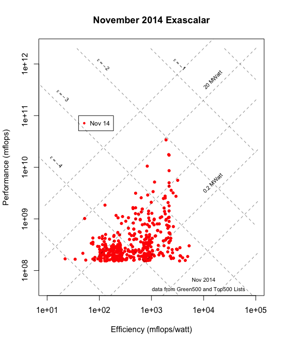
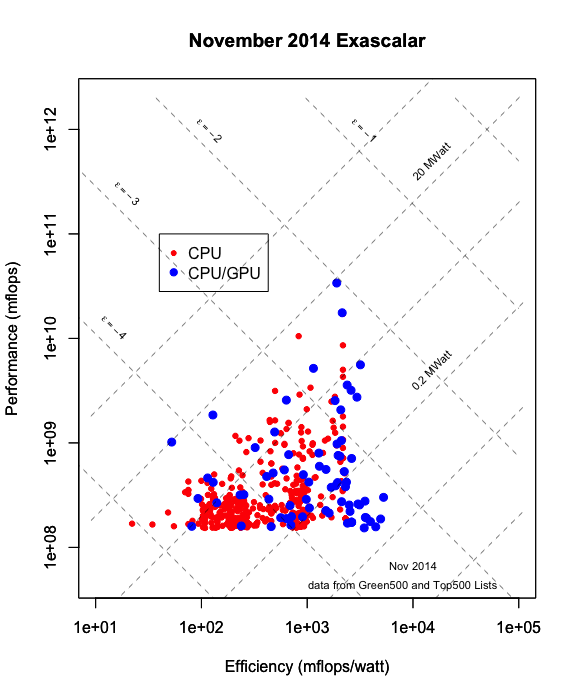
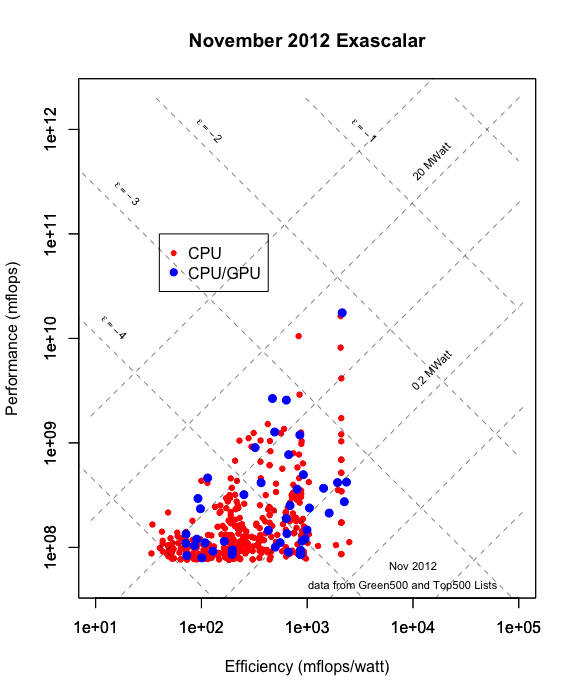
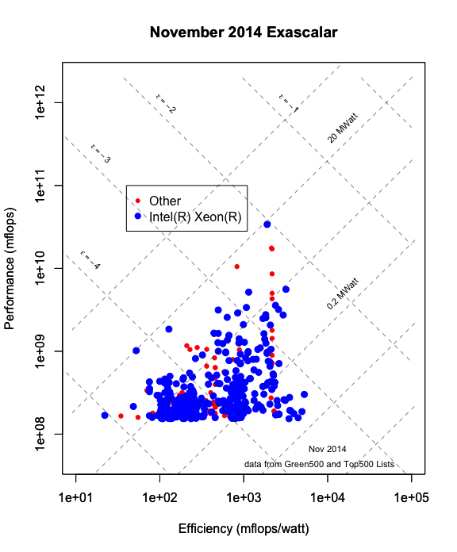

# Visualizing Top500/Green500 Influencers with Exascalar
Winston Saunders  
December 2, 2014  

###Visulizing Key Trends

Exascalar is one of the best ways to visualize changes in the [Green500](http:\\green500.org) and [Top500](http:\\top500.org) lists since it compares both system performance and efficiency in one common analysis. 

In this analysis I look at visualizing architectural influencers of Exascalar through several analyses. This analysis was suggested in a tweet from the folks at [HPC Wire](http://www.hpcwire.com/).

This is a first cut at this analysis. In the future I plan to migrate plotting to ggplot2 and add some interactive features. 

### November 2014 Exascalar Plot 

For reference here is the November 2014 Exascalar Plot.
  

###November 2014 Accelerators versus CPU-only

In this analysis systems with GPUs made by NVidia, PEZY, AMD FirePro and Intel Xeon Phi are highlighted. (Respectful of coyrights). 

In all there are 72 systems out of the Top/Green500 highlighted. (14.4%).

###November 2012 Accelerators versus CPU-only

For comparison, this is the same analysis for the 2012 Exascalar version of the Top/Green500.  

In this analysis systems with GPUs made by NVidia, PEZY, AMD FirePro and Intel Xeon Phi are highlighted. (Respectful of copyrights). 

In all there are 54 systems out of the Top/Green500 highlighted. (10.8%).

###Intel Xeon 

This analysis looks at which computers rely on Intel Xeon for the CPU function

In this analysis systems with Intel Xeon processors (Copyrights respected). 

In all there are 425 systems out of the Top/Green500 highlighted. (85%).

