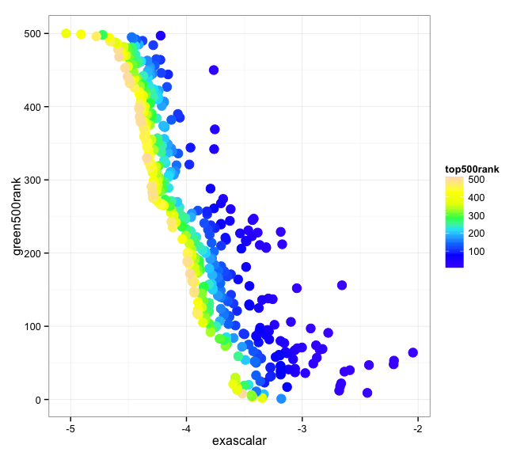

# Correlating Green500 and Top500 data with Power and Exascalar
Winston Saunders  
November 29, 2014  

###Looking for correlations Top500, Green500, and Exascalar

Exascalar is one of the best ways to visualize changes in the [Green500](http:\\green500.org) and [Top500](http:\\top500.org) lists since it compares both the performance and efficiency of systems in one common analysis. A principal reason for this is that both Power and Exascalar make up the principal components of an idealized "Triangular" Exascalar distribution as a function of Performance (mflops) and Efficiency (mflops/watt). 

In this study we'll explore these correlations and draw some counterintuitive conclusions. 

### Top500 and Green500 data appear uncorrelated

Although it is intuitively obvious that a higher efficiency ranking should be related to higher performance ranking, a straight plot of the Top500 and Green500 shows little correlation between the two lists. 

Data points have been sized to reflect system power, where a stronger correlation to Top500 rank seems to be apparent. 

A linear fit shows that the green500 predicts 12.8 % of the variation in the Top500.

###Using Power as a predictor of Top500 rank 

A very different picture emerges, however, if we use Power as a predictor of Top500 rank and factor the data for the Green500 ranking. Note that for a given power, a higher Top500 ranking (lower rank number) correlates with a higher Green500 ranking (lower Green500 rank number). 

###Exascalar as a predictor of Green500 Rank

The graph below shows the Green500 rank as predicted by the Exascalar rank. Here a clear correlation is observed, as expected, with high exascalar rank (low rank number) predicting a high Green500 rank. In addition, the correlation of the Top500 ranking with Exascalar ranking is apparent thru the color factoring of the data. 

It might be surprising that a low Top500 ranking (again a low ranking corresponds to a high rank number) should translate to a higher Green500 ranking (lower rank number). This counterintuitive result comes about because of the "negative" slope of the Exascalar line. Recall that for Exascalar an increase in performance at constant efficiency(through higher power) is valued the same as an increase in efficiency at constant performance. 

Here is a graph of the Green500 rank as a function of Exascalar. The surprising "families" of curves that are apparent warrant a deeper look. 

A stronger correlation exists and the linear model explains 82.6 % of the variation. 

###Some conclusions

While the Top500 and Green500 lists measure a common set of computers, their ranking appears to be largely 
