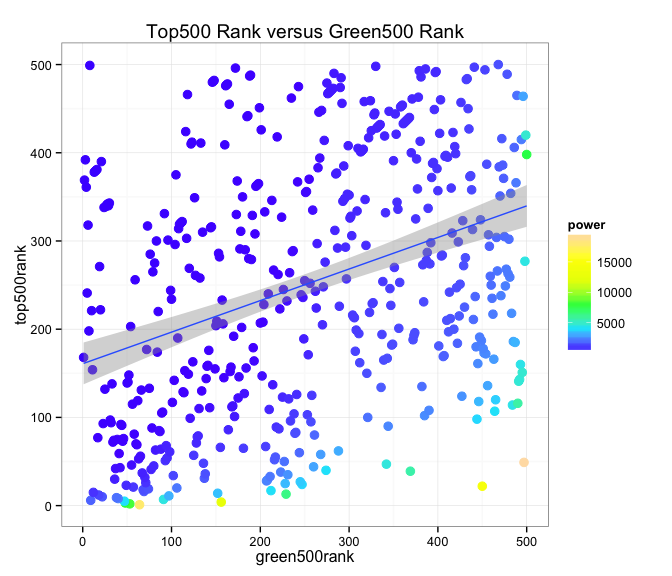
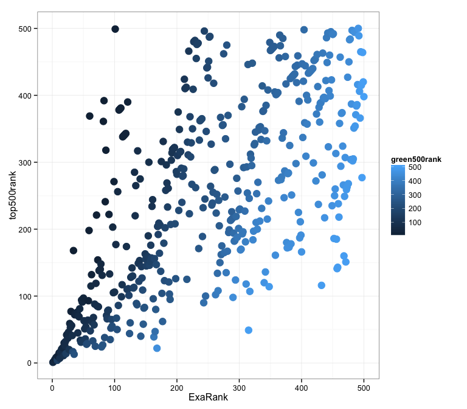
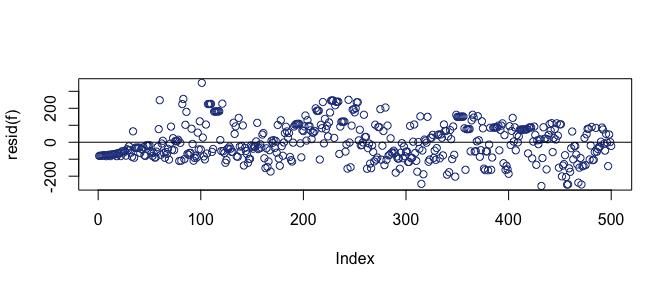
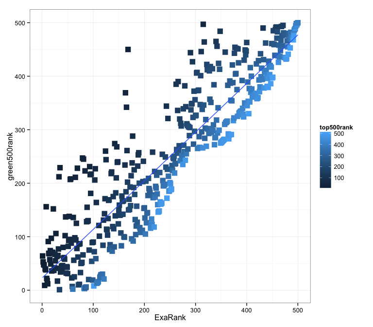

# Correlating Green500 and Top500 data with Exascalar
Winston Saunders  
November 29, 2014  

###Looking for correlations Top500, Green500, and Exascalar

Exascalar is one of the best ways to visualize changes in the [Green500](http:\\green500.org) and [Top500](http:\\top500.org) lists since it compares both the performance and efficiency of systems in one common analysis. 

In this study we look for correlations in the populations of the supercomputers as represented by metrics of Top500, Green500, and Exascalar.

### Top500 and Green500 data appear uncorrelated

Although it is intuitively obvious that a higher efficiency ranking should be related to higher performance ranking, a straight plot of the Top500 and Green500 shows little correlation between the two lists. 

Data points have been sized to reflect system power, where a stronger correlation to Top500 rank seems to be apparent. 

A linear fit shows that the green500 predicts 12.8 % of the variation in the Top500.

###Using Exascalar Rank as a predictor of top500 rank

A stronger correlation exists and the linear model explains 46 % of the variation. 

However, the data are heteroskedastic as showh by the residual plot below.

###Using Exascalar rank as a predictor of green500 rankigher 

In this analysis a worse Top500 rank correlates to a lower 

A stronger correlation exists and the linear model explains 82.6 % of the variation. 
